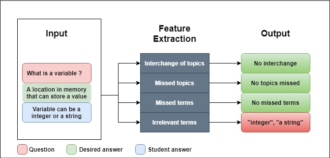

# Automatic-Formative-Assessment

An automatic feedback system for the students' short textual answers through feature extraction. We extract four features from students' short textual answers to provide a comprehensive
feedback by comparing with the desired answer. These features include:
1. Interchange of topics
2. Missed topics
3. Missed terms
4. Irrelevant terms

This implementation can be integrated to any domain or subject with no training required. However, currently we use domain-specific trained fasttext word embeddings on computer-science 
data. We also created an automatic pipeline for scoring criteria based on these four features.

# Overview



# Requirements

# Datasets
 We tested our pipeline on Mohler dataset and Neural Networks dataset. Mohler dataset is a publicly available computer-science domain dataset contains 2273 student answers for 80 questions
collected from the University of Texas undergraduate students. The student answers are graded from 0(totally wrong) to 5(totally correct). Neural networks dataset is a private dataset 
provided by Bonn-Rhein-Sieg University of Applied Sciences, MAS department. It contains 1137 student answers for 40 questions and graded from 0-2.

# Installation

# Evaluation


# Results

## Qualitative outputs

```
**Question:**  What is a variable?
**Desired answer:** A location in memory that can store a value.
**Student answer:** Variable can be a integer or a string in a program.
------------------------------------------------------------------------
* **Interchange of topics:** None
* **Missed topics:** None
* **Missed terms:** *'memory', 'location'*
* **Irrelevant terms:** *'integer', 'program'*
```

## Quantitative outputs


# Future Work

* **High inference time**
	- Currently, each student answer takes nearly 45 seconds to be graded and generate feedback. 
	- This can be reduced by using sentence embeddings instead of Sum of Word Embeddings (SOWE)

* **Domain-specific**
	- We use fasttext word embeddings trained on computer-science domain data for computer-science datasets
	- This can be generalized by using robust pretrained embeddings

* **English subject**
	- We remove stopwords and preprocess the text through our pipeline.
 	- Henceforth, this may not be useful to grade the English language textual answers currently.


# Reference

```
@mastersthesis{2021Gaddipati,
    author = {Gaddipati, Sasi Kiran and Pl{\"o}ger, Paul G. and Hochgeschwender, Nico and Metzler, Tim},
    title = {Automatic Formative Assessment for Students’ Short Text Answers through Feature Extraction},
    school = {Hochschule Bonn-Rhein-Sieg},
    address = {Grantham-Allee 20, 53757 St. Augustin, Germany},
    month = {April},
    year = {2021},
    note = {WS18/19 H-BRS 
            Pl{\"o}ger, Hochgeschwender, Metzler supervising}
}
```